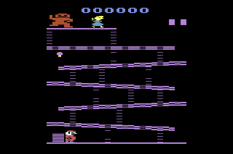

# Donkey Kong
### FPRO/MIEIC, 2019/20
### José Pedro Peixoto Ferreira (up201904515@fe.up.pt)
### 1MIEIC04

#### Objetivo

Criar um clone do clássico Donkey Kong em Pygame. Explorar algumas pequenas alterações ao jogo, de modo a dar um cunho único ao projeto. 

#### Descrição

*--- O Donkey Kong é considerado o jogo percursor do género plataforma, para muitos o maior hit dos arcades, que contou com versões para Atari 2600, NES, entre outras.
     Este projeto baseia-se no primeiro nível do jogo, aquele cujo lay-out é mais familiar ao público comum. Conta com um modo clássico em que pretende oferecer uma experiência igual à do jogo original. O ponto mais apelativo do projeto é, contudo, o modo remix. Neste modo o utilizador pode personalizar o seu jogo, mudando a seu gosto vários aspetos do jogo, entre eles a velocidade do Mario, dos barris e até a gravidade. Por fim ainda é possível escolher mudar a localização das escadas para sítios aleatórios, gerando opções virtualmente infinitas de jogo, mas sempre possíveis de "passar". ---*

#### UI

### Pacotes

- Pygame
- Math
- Random

#### Tarefas

1. **FUNDO**
   1. plataformas (poligonos cheios a vermelho): lista de pontos ((x1, y1), (x2, y2))
   1. escadas: lista de pontos ((x1, y1), (x2, y2))
1. **JOGADOR**
   1. jogador variáveis: pos_x, pos_y
   1. desenhar o jogador, teclas esquerda-direita
   1. salto: quando carrega, coloca variável tempo_salto=50. enquanto for positiva, vai para cima. vai decrescendo a variável ao longo do tempo até 0.
   1. gravidade: se não estiver numa plataforma, ele cai a uma velocidade constante.
   1. escadas: cima/baixo quando está numa escada.
1. **BARRIL**
   1. coordenadas pos_x, pos_y, dir (-1, 1). desenhava e ia movendo.
   1. colisão entre o barril e o jogador (bounding box)
1. **EXTRAS**
   * animações
   * pontuação
   * menu
1. **FUTURO**
   * martelo
   * plataformas diferentes

### 18/11/2019
